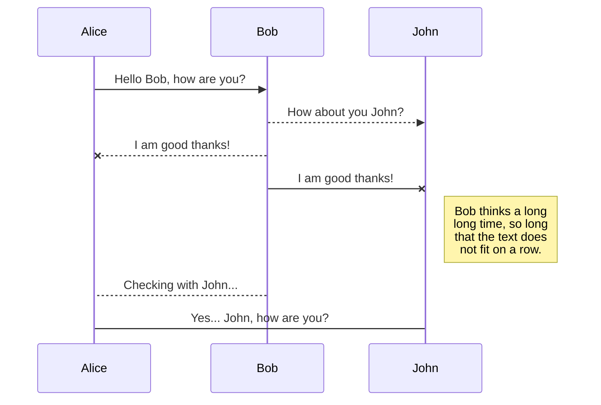

Hello and welcome to this blog. Edit the `index.md` file to change this content. All pages on the blog, including this one, use [Markdown](https://guides.github.com/features/mastering-markdown/). You can include images:

## Math

$$ x = y^2 $$

This sentence uses `$` delimiters to show math inline:  $\sqrt{3x-1}+(1+x)^2$

## Mermaid

## SmartyPants

SmartyPants converts ASCII punctuation characters into "smart" typographic punctuation HTML entities. For example:

|                |ASCII                          |HTML                         |
|----------------|-------------------------------|-----------------------------|
|Single backticks|`'Isn't this fun?'`            |'Isn't this fun?'            |
|Quotes          |`"Isn't this fun?"`            |"Isn't this fun?"            |
|Dashes          |`-- is en-dash, --- is em-dash`|-- is en-dash, --- is em-dash|

## This is a title

And you can include links, like this [link to fast.ai](https://www.fast.ai). Posts will appear after this file. 
